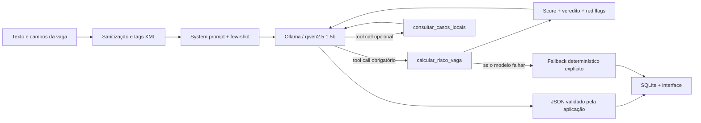

# VagaCheck

O VagaCheck ajuda pessoas candidatas a reconhecer sinais de golpe em ofertas recebidas por WhatsApp, e-mail, redes sociais ou sites de recrutamento. A aplicação transforma o texto da vaga em um score auditável e usa IA generativa local para explicar as evidências e sugerir um próximo passo seguro.

> O resultado é uma triagem preventiva, não uma declaração jurídica de fraude. Empresa, CNPJ, domínio e identidade do recrutador precisam ser verificados por canais independentes.

## Demonstração em uma frase

O VagaCheck combina um motor de regras, disponibilizado ao LLM como ferramenta, com um agente local via Ollama que produz uma explicação estruturada sem poder alterar o veredito determinístico.

## Como a IA é usada

O modelo não calcula o score livremente. No modo padrão, o orquestrador executa `calcular_risco_vaga` como preflight, entrega as red flags ao modelo com papel `tool` e solicita o JSON com resumo, recomendação, verificações, limitações e alerta de privacidade. Essa escolha evita desperdiçar uma inferência porque o modelo de 1,5B se mostrou inconsistente ao selecionar tools. Para comparar modelos maiores, `LLM_TOOL_MODE=autonomous` deixa o próprio LLM iniciar a chamada. Uma segunda tool, `consultar_casos_locais`, pode contextualizar a análise no modo autônomo; ela não confirma fraude.



Essa arquitetura é híbrida de propósito: decisões críticas e reproduzíveis ficam nas regras; o LLM é usado onde agrega valor, na adaptação da explicação para uma pessoa leiga.

## Decisões de engenharia de LLM

### Modelo e provedor

O padrão é `qwen2.5:1.5b` servido localmente pelo Ollama. A escolha prioriza privacidade - textos de vagas podem conter nomes, e-mails ou telefones - e permite executar a demonstração sem custo por chamada, inclusive em hardware modesto. O modelo declara suporte a tools no Ollama e é configurável por `OLLAMA_MODEL`.

Limitações: um modelo local de 4B tende a seguir tools e schemas com menos consistência do que APIs pagas maiores; a primeira inferência pode ser lenta; o desempenho depende da máquina. A aplicação valida o protocolo e usa fallback determinístico em caso de timeout, JSON inválido, tool ausente ou recomendação contraditória.

Com um modelo pago de maior capacidade, espera-se maior aderência ao tool calling, melhor redação e menos reparos. Em troca, haveria custo, dependência de rede e envio dos dados a terceiros. O fluxo foi isolado em `OllamaClient`, portanto o provedor pode ser trocado sem alterar scoring, banco ou UI.

### Chamada direta em vez de LangChain/LangGraph

A integração usa `urllib.request` contra `POST /api/chat` do Ollama. Para duas ferramentas e no máximo três ciclos, um framework adicionaria dependências e abstrações sem ganho proporcional. O loop explícito torna visíveis mensagens, tools, validação e fallback - aspectos centrais desta avaliação.

LangGraph passaria a fazer sentido se o produto incorporasse ramificações, aprovação humana, retries por nó, consulta externa de CNPJ e memória durável. RAG e multiagente não foram usados porque não há corpus confiável nem papéis independentes que justifiquem a complexidade.

### System prompt e estratégia

O prompt principal está em [`prompts/system_prompt.txt`](prompts/system_prompt.txt) e contém:

- persona e objetivo restrito;
- hierarquia de instruções e isolamento da vaga em `<vaga_nao_confiavel>`;
- defesa contra prompt injection e proibição de inventar verificações externas;
- fluxo obrigatório de tool calling e regra que impede o modelo de alterar o score;
- mapeamento explícito entre veredito e recomendação;
- contrato de saída JSON.

Dois exemplos contrastivos em [`prompts/few_shot_examples.json`](prompts/few_shot_examples.json) demonstram tom e nível de cautela para um golpe evidente e uma vaga sem sinais fortes. A estratégia combina persona, tags XML, few-shot e structured output. O prompt pede justificativa curta baseada em evidências, não chain-of-thought: raciocínio interno longo não é necessário para o usuário nem para auditoria.

### Ferramentas disponibilizadas

As definições tipadas e os handlers ficam em [`tools/job_tools.py`](tools/job_tools.py).

| Tool | Por que existe | Controles |
|---|---|---|
| `calcular_risco_vaga` | Dá ao modelo score, veredito e red flags reproduzíveis | parâmetros tipados; chamada obrigatória e única; resultado validado contra o cálculo do servidor |
| `consultar_casos_locais` | Recupera contexto do histórico sem prometer checagem externa | termo de 3-80 caracteres; limite 1-5; SQL parametrizado; aviso de que similaridade não confirma fraude |

Tools desconhecidas, argumentos inválidos e falhas de execução viram erro controlado. O agente não oferece acesso genérico ao banco, filesystem, shell ou internet. O campo `modo_tool_call` registra se a chamada partiu do modelo ou do orquestrador - uma adaptação necessária porque o `qwen2.5:1.5b` nem sempre emite tool calls mesmo quando o provedor declara essa capacidade.

### Parâmetros

| Parâmetro | Padrão | Justificativa |
|---|---:|---|
| `temperature` | `0.2` | baixa variação para uma tarefa de segurança e JSON estável, preservando alguma naturalidade |
| `top_p` | `0.9` | limita a cauda de tokens improváveis sem tornar o texto excessivamente rígido |
| `seed` | `42` | aumenta a reprodutibilidade da demonstração e dos experimentos |
| `num_predict` | `320` | comporta o JSON conciso e limita latência/respostas prolixas |
| ciclos do agente | `3` | permite tool call e resposta final, com uma margem, sem loop ilimitado |

O timeout padrão do Ollama é 120 segundos (`OLLAMA_TIMEOUT`) para acomodar a primeira carga do modelo em CPU; após aquecimento, as chamadas tendem a ser mais rápidas.

As variáveis `LLM_TEMPERATURE`, `LLM_TOP_P`, `LLM_SEED` e `LLM_NUM_PREDICT` permitem repetir experimentos. A comparação real de três configurações, incluindo tempos e limitações de interpretação, está em [`docs/experimentos-llm.md`](docs/experimentos-llm.md).

### Structured output e validação

O Ollama é chamado em JSON mode. Em seguida, a aplicação valida o resultado contra um schema próprio que restringe `recomendacao` a três valores e exige todos os campos. Ela também valida semanticamente que a recomendação corresponde ao veredito da tool e que existem de duas a quatro ações e pelo menos uma limitação. Saída inválida nunca é exibida como se fosse confiável. Essa dupla camada foi mais estável com o modelo de 1,5B do que enviar um schema extenso ao provedor.

## Como executar

Requisitos: Python 3.11+ e Ollama. Nenhum pacote Python externo é necessário.

```bash
ollama pull qwen2.5:1.5b
ollama serve
python app.py --host 127.0.0.1 --port 8000
```

Abra `http://127.0.0.1:8000`. No Windows, `./scripts/start_local.ps1` inicia a aplicação. Se o Ollama não estiver disponível, o score ainda funciona e a interface mostra `Fallback sem IA`, o que torna a falha observável em vez de ocultá-la.

Configuração opcional:

```powershell
$env:OLLAMA_MODEL = "qwen2.5:7b"
$env:OLLAMA_URL = "http://127.0.0.1:11434"
$env:LLM_TEMPERATURE = "0.2"
$env:LLM_TOOL_MODE = "orchestrated" # use "autonomous" para testar seleção pelo modelo
python app.py
```

Testes:

```bash
python -m unittest discover -s tests -v
```

Os testes do agente usam um cliente simulado: verificam tool calling, structured output e fallback sem exigir um modelo instalado. Para testar o modelo real, use [`scripts/experiment_llm.py`](scripts/experiment_llm.py).

## Estrutura relevante

```text
agents/
  risk_agent.py             loop do agente, cliente Ollama, schema e fallback
prompts/
  system_prompt.txt         prompt principal versionado
  few_shot_examples.json    exemplos contrastivos
tools/
  job_tools.py              schemas tipados e handlers das tools
app/
  scoring.py                score determinístico e auditável
  database.py               SQLite e busca local limitada
  server.py                 API HTTP e integração do fluxo
docs/
  experimentos-llm.md       hipótese, método e resultados
  elevator-pitch.md         roteiro de 3 minutos e perguntas prováveis
tests/
  test_agent.py             protocolo do agente e fallback
  test_scoring.py           regras de risco
```

## O que funcionou

- Separar decisão e explicação: o LLM não consegue suavizar nem elevar o score por conta própria.
- Few-shot contrastivo melhorou o tom: alerta sem afirmar categoricamente que uma vaga é fraude. Os exemplos só entram depois da tool, porque colocá-los antes levou o modelo pequeno a imitar a resposta e pular a chamada.
- Schema mais validação semântica tornam falhas do modelo detectáveis.
- A vaga é isolada como dado não confiável e caracteres de tags são escapados, reduzindo o risco de prompt injection.
- Fallback mantém a função principal disponível e comunica claramente que não houve geração por IA.

## O que não funcionou e ajustes

- A versão anterior só possuía um roadmap de IA; isso não atendia a avaliação final. O motor foi preservado e convertido em tool de um agente real.
- O `qwen2.5:1.5b` omitiu o tool call em teste real. Em vez de aceitar a resposta direta, o orquestrador passou a executar a tool obrigatória, devolver seu resultado ao modelo e registrar esse modo no output.
- Temperaturas altas foram descartadas para a configuração padrão porque aumentam variação de estrutura e tom sem benefício para triagem de risco.
- Confiar apenas na instrução “responda em JSON” é frágil. Foi adicionado schema nativo, parser, campos obrigatórios e validação da recomendação.
- Dar ao modelo liberdade para decidir o score reduziria auditabilidade. A decisão ficou no motor de regras e o modelo ganhou a função mais adequada: explicação.

## Limitações e próximos passos

- O sistema não consulta Receita Federal, DNS, redes sociais nem reputação externa.
- As regras são heurísticas, não coeficientes treinados, e podem produzir falsos positivos ou negativos.
- O histórico local é pequeno e não constitui RAG nem base de fraudes confirmadas.
- Próximos passos responsáveis: conjunto rotulado brasileiro, avaliação de precisão/recall, consulta de CNPJ com consentimento, testes adversariais ampliados e aprovação humana para casos de alto impacto.

## Apresentação

O roteiro cronometrado e respostas às perguntas da rubrica estão em [`docs/elevator-pitch.md`](docs/elevator-pitch.md). O foco é explicar o porquê das decisões, não a interface.
