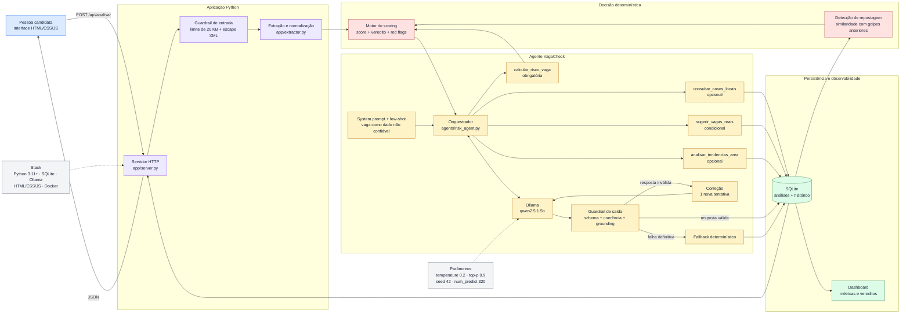

# VagaCheck

> O resultado é uma triagem preventiva, não uma declaração jurídica de fraude. Empresa, CNPJ, domínio e identidade do recrutador precisam ser verificados por canais independentes.

## 1. Descrição do problema e da solução

Golpes de vaga de emprego circulam por WhatsApp, e-mail, redes sociais e sites de recrutamento, geralmente com pequenas variações do mesmo texto reaplicado várias vezes. A pessoa candidata raramente tem tempo ou repertório para checar CNPJ, domínio ou padrão de golpe conhecido antes de responder.

O VagaCheck recebe o texto colado da vaga, calcula um **score de risco determinístico e auditável** a partir de um motor de regras (`app/scoring.py`), e usa um **LLM local via Ollama** para traduzir esse resultado técnico em uma explicação legível, com pontos concretos de verificação. Quando o veredito não é seguro, o sistema também sugere vagas legítimas parecidas e contextualiza a área com dados históricos internos — fechando o ciclo de "detectei o problema" para "aqui está uma alternativa".

**Papel exato da IA generativa**: o LLM nunca decide se a vaga é golpe. Essa decisão vem inteiramente do motor de regras, que também compara a vaga nova contra golpes já detectados no histórico (repostagem). O LLM explica o veredito, formata a resposta, e pode chamar ferramentas adicionais de contexto — nunca de decisão.

## 2. Arquitetura de LLM



Fluxo em palavras: **input do usuário → guardrail de entrada → motor de regras (decide) → prompt montado dinamicamente com o resultado → modelo local → tools de contexto/ação → guardrail de saída (valida e corrige) → resposta**. Essa arquitetura é híbrida de propósito: decisões críticas e reproduzíveis ficam nas regras; o LLM é usado onde agrega valor — adaptar a explicação para uma pessoa leiga e sugerir próximos passos.

## 3. Decisões e justificativas

### Por que esse modelo

O padrão é `qwen2.5:1.5b` servido localmente pelo Ollama. A escolha prioriza privacidade — textos de vaga podem conter nomes, e-mails ou telefones — e permite rodar a demonstração sem custo por chamada, inclusive em hardware modesto. O modelo declara suporte a tools no Ollama e é configurável por `OLLAMA_MODEL`.

Limitação conhecida: um modelo local pequeno segue tools e schemas com menos consistência do que APIs pagas maiores. É por isso que o sistema não depende de o modelo "se comportar bem" — o orquestrador força a tool crítica e a aplicação valida e corrige a saída (seção de guardrails abaixo). Com um modelo pago maior, esperaríamos maior aderência a tool calling e menos correções, ao custo de dependência de rede e envio de dados a terceiros. O `OllamaClient` isola essa decisão, então o provedor pode ser trocado sem alterar scoring, banco ou UI.

### Por que chamada direta em vez de LangChain/LangGraph

A integração usa `urllib.request` contra `POST /api/chat` do Ollama. Para quatro ferramentas e no máximo três ciclos, um framework adicionaria dependências e abstrações sem ganho proporcional — o loop explícito é o que torna visíveis, e testáveis, as mensagens, tools, validação, correção e fallback. LangGraph passaria a fazer sentido se o produto incorporasse muitos nós de decisão ramificados, aprovação humana, ou memória durável entre sessões — nenhum desses ainda existe aqui.

### Por que esses parâmetros

| Parâmetro | Padrão | Justificativa |
|---|---:|---|
| `temperature` | `0.2` | baixa variação para uma tarefa de segurança e JSON estável, preservando alguma naturalidade |
| `top_p` | `0.9` | limita a cauda de tokens improváveis sem tornar o texto excessivamente rígido |
| `seed` | `42` | aumenta a reprodutibilidade da demonstração e dos experimentos |
| `num_predict` | `320` | comporta o JSON conciso e limita latência/respostas prolixas |
| ciclos do agente | `3` | tool call + correção + resposta final, sem loop ilimitado |
| correções do agente | `1` | uma chance de o próprio modelo se corrigir antes do fallback — mais que isso não trouxe ganho nos testes e adiciona latência |

As mesmas configurações valem para as tools novas: não criamos um perfil de temperatura diferente para elas, porque a saída continua sendo JSON estrito — criatividade extra não ajudaria e arriscaria quebrar o schema.

### Por que essas ferramentas

| Tool | Por que existe | Controles |
|---|---|---|
| `calcular_risco_vaga` | Dá ao modelo score, veredito e red flags reproduzíveis | parâmetros tipados; chamada obrigatória e única; resultado validado contra o cálculo do servidor |
| `consultar_casos_locais` | Recupera contexto do histórico por palavra-chave | termo de 3-80 caracteres; limite 1-5; SQL parametrizado; aviso de que similaridade não confirma fraude |
| `sugerir_vagas_reais` | Sugere vagas legítimas do histórico + links de busca em plataformas confiáveis, quando o veredito não é seguro | só deve ser chamada se `recomendacao != prosseguir_com_cautela`; links restritos a um template de domínios confiáveis; nunca inventados (ver guardrail de saída) |
| `analisar_tendencias_area` | Contextualiza a área com indicadores agregados do histórico local (volume + taxa de risco), estilo quadrante | rotulado explicitamente como dado interno, nunca como pesquisa de mercado real; chamada no máximo uma vez |

Cada tool tem parâmetros tipados e validados, não acesso genérico a banco, filesystem ou internet. O campo `modo_tool_call` registra se a chamada partiu do modelo ou do orquestrador — necessário porque o `qwen2.5:1.5b` nem sempre emite tool calls mesmo quando o provedor declara essa capacidade.

**Por que não demos ao LLM uma tool de busca real na web**: avaliamos essa opção para "vagas reais parecidas" e decidimos começar por links de busca pré-montados (sem API externa) — mais barato, sem risco de ToS, e sem abrir uma superfície de recomendação de sites não confiáveis. Uma tool de busca real é um caminho de evolução natural, não uma necessidade imediata.

### System prompt

O prompt principal está em [`prompts/system_prompt.txt`](prompts/system_prompt.txt) e contém: persona e objetivo restrito; hierarquia de instruções e isolamento da vaga em `<vaga_nao_confiavel>`; defesa contra prompt injection e proibição de inventar verificações externas; fluxo obrigatório de tool calling, incluindo quando chamar cada tool nova; mapeamento explícito entre veredito e recomendação; e o contrato de saída JSON, agora incluindo os campos condicionais `sugestoes_vagas_reais` e `tendencia_area`. Dois exemplos contrastivos em [`prompts/few_shot_examples.json`](prompts/few_shot_examples.json) demonstram tom e nível de cautela. O prompt pede justificativa curta baseada em evidências, não chain-of-thought — raciocínio interno longo não é necessário para o usuário nem para auditoria.

### Guardrails de entrada e de saída

**Entrada**: o texto da vaga é tratado como dado não confiável, isolado em `<vaga_nao_confiavel>` com escape de `<`/`>` (defesa contra fechamento indevido da tag). O servidor limita o corpo da requisição a `MAX_BODY_BYTES` (20 KB), protegendo custo e reduzindo espaço para esconder um payload de injeção. O motor de regras detecta, adicionalmente, padrões típicos de tentativa de manipulação de IA (`TENTATIVA_MANIPULACAO_IA`) — um golpe legítimo não teria motivo para tentar manipular um classificador, então esse padrão também soma ao score.

**Saída**: `_validate_output` garante schema e coerência semântica (a recomendação bate com o veredito da tool; existem entre duas e quatro ações e ao menos uma limitação; `sugestoes_vagas_reais` é obrigatório quando o veredito não é seguro). `_check_grounding` vai além do schema: verifica se links e vagas citados em `sugestoes_vagas_reais` realmente vieram da tool `sugerir_vagas_reais` (não inventados) e rejeita afirmações de verificação externa não realizada (ex.: "confirmamos o CNPJ"). Se qualquer uma dessas checagens falhar, o **agente de correção** aponta o erro específico ao modelo e dá uma chance de reformular — dentro do mesmo orçamento de ciclos — antes de cair no fallback determinístico.

### Por que não um LLM-as-judge

Consideramos adicionar um agente juiz para avaliar a qualidade da resposta antes de entregá-la. Decidimos não adicionar, por ora, por três razões: (1) a maior parte do risco real — alucinação de links, alegações falsas de verificação, repostagem de golpe conhecido — já é verificável por código, de forma determinística e mais barata; (2) usar o mesmo modelo pequeno como gerador e como juiz reproduziria os mesmos pontos cegos, sem ganho real de confiabilidade; (3) um juiz de escopo amplo ("avalie essa resposta") erra mais que checagens binárias estreitas. Se testes futuros mostrarem falhas de tom ou qualidade que o código não capta, o próximo passo seria um juiz de escopo estreito (uma pergunta binária por vez), reaproveitando o mesmo ciclo de correção — não um agente novo e paralelo.

### RAG: por que light, sem embeddings

"Vagas reais similares" e "tendências por área" usam retrieval simples sobre o histórico local em SQLite (`similar_legit_jobs`, `trend_by_area`), sem embeddings nem vector DB. O volume de dados desta instância não justifica esse custo. Se o histórico crescer para milhares de análises, embeddings + busca semântica passariam a compensar.

### Comparação de propostas novas contra golpes já detectados

Além do RAG-lite para vagas legítimas, o motor de regras agora compara toda vaga nova contra os casos já marcados como golpe (`find_similar_flagged_case`, via `difflib.SequenceMatcher` sobre título+descrição). Golpes costumam ser reaplicados com pequenas variações de texto; acima de 72% de similaridade, a nova red flag `REPOSTAGEM_DE_GOLPE_CONHECIDO` (peso 30) dispara com evidência citando o caso e a data. Essa comparação é **determinística e automática** — roda em toda análise, não depende do LLM decidir chamar uma tool — porque é exatamente o tipo de sinal objetivo que deveria sempre ser verificado, e não opcional.

### Structured output e validação

O Ollama é chamado em JSON mode. A aplicação valida o resultado contra um schema próprio (campos obrigatórios, `recomendacao` restrita a três valores, coerência com o veredito da tool) e, agora, contra o guardrail de grounding descrito acima. Saída inválida nunca é exibida como se fosse confiável.

## 4. O que funcionou

- Separar decisão e explicação: o LLM não consegue suavizar nem elevar o score por conta própria.
- Few-shot contrastivo melhorou o tom: alerta sem afirmar categoricamente que uma vaga é fraude. Os exemplos só entram depois da tool, porque colocá-los antes levou o modelo pequeno a imitar a resposta e pular a chamada.
- Schema mais validação semântica tornam falhas do modelo detectáveis — e o agente de correção aproveitou esse mesmo mecanismo para dar ao modelo uma segunda chance antes do fallback, sem precisar de um agente separado.
- O guardrail de grounding pegou, em teste manual, um link inventado que não vinha de nenhuma tool — confirmando que checagem determinística cobre exatamente o tipo de alucinação mais provável nesse fluxo.
- A vaga é isolada como dado não confiável e caracteres de tags são escapados, reduzindo o risco de prompt injection; transformar essa mesma detecção em red flag de negócio (`TENTATIVA_MANIPULACAO_IA`) aproveitou a mesma checagem para dois fins.
- A comparação determinística com golpes já detectados (repostagem) generalizou bem: uma vaga com poucos sinais isolados, mas texto quase idêntico a um golpe confirmado, corretamente sobe para risco máximo.
- Fallback mantém a função principal disponível e comunica claramente que não houve geração por IA.

## 5. O que não funcionou e ajustes

- A versão anterior só possuía um roadmap de IA; isso não atendia a avaliação final. O motor foi preservado e convertido em tool de um agente real.
- O `qwen2.5:1.5b` omitiu o tool call em teste real. Em vez de aceitar a resposta direta, o orquestrador passou a executar a tool obrigatória, devolver seu resultado ao modelo e registrar esse modo no output.
- Temperaturas altas foram descartadas para a configuração padrão porque aumentam variação de estrutura e tom sem benefício para triagem de risco.
- Confiar apenas na instrução "responda em JSON" é frágil. Foi adicionado schema nativo, parser, campos obrigatórios e validação da recomendação — e, mais recentemente, o guardrail de grounding, porque schema válido não implica conteúdo fiel às tools.
- Cogitamos um LLM-as-judge para avaliar tom e qualidade da resposta; descartamos por ora (ver justificativa na seção 3) em favor de checagens determinísticas mais baratas e confiáveis, reservando o juiz para lacunas que o código genuinamente não consiga cobrir.
- Dar ao modelo liberdade para decidir o score reduziria auditabilidade. A decisão ficou no motor de regras e o modelo ganhou a função mais adequada: explicação.
- A primeira versão da comparação de repostagem não existia; sinais como "cobrança antecipada" e "urgência excessiva" já cobriam parte do problema, mas nenhum deles capturava o padrão específico de golpe reaplicado com o mesmo texto — daí a necessidade de uma checagem de similaridade dedicada.

## Limitações e próximos passos

- O sistema não consulta Receita Federal, DNS, redes sociais nem reputação externa.
- As regras são heurísticas, não coeficientes treinados, e podem produzir falsos positivos ou negativos.
- O histórico local é pequeno e não constitui RAG com embeddings nem base de fraudes confirmadas em larga escala.
- Os links de "vagas reais similares" são buscas pré-montadas em plataformas confiáveis, não resultados ao vivo — uma tool de busca real (com domínios restritos) é o próximo passo natural.
- Próximos passos responsáveis: conjunto rotulado brasileiro, avaliação de precisão/recall, consulta de CNPJ com consentimento, testes adversariais ampliados e aprovação humana para casos de alto impacto.

## Como executar

Requisitos: Python 3.11+ e Ollama. Nenhum pacote Python externo é necessário.

```bash
ollama pull qwen2.5:1.5b
ollama serve
python app.py --host 127.0.0.1 --port 8000
```

Abra `http://127.0.0.1:8000`. No Windows, `./scripts/start_local.ps1` inicia a aplicação. Se o Ollama não estiver disponível, o score ainda funciona e a interface mostra `Fallback sem IA`, o que torna a falha observável em vez de ocultá-la.

Configuração opcional:

```powershell
$env:OLLAMA_MODEL = "qwen2.5:7b"
$env:OLLAMA_URL = "http://127.0.0.1:11434"
$env:LLM_TEMPERATURE = "0.2"
$env:LLM_TOOL_MODE = "orchestrated" # use "autonomous" para testar seleção pelo modelo
python app.py
```

Testes:

```bash
python -m unittest discover -s tests -v
```

Os testes do agente usam um cliente simulado: verificam tool calling, structured output, correção e fallback sem exigir um modelo instalado. Para testar o modelo real, use [`scripts/experiment_llm.py`](scripts/experiment_llm.py).

## Estrutura relevante

```text
agents/
  risk_agent.py             loop do agente, cliente Ollama, schema, correção e grounding
prompts/
  system_prompt.txt         prompt principal versionado
  few_shot_examples.json    exemplos contrastivos
tools/
  job_tools.py              schemas tipados e handlers das quatro tools
app/
  scoring.py                score determinístico, repostagem e injeção
  database.py               SQLite, busca local e histórico de golpes
  server.py                 API HTTP, guardrail de tamanho e integração do fluxo
docs/
  experimentos-llm.md       hipótese, método e resultados
  elevator-pitch.md         roteiro de 3 minutos e perguntas prováveis
tests/
  test_agent.py             protocolo do agente, correção e fallback
  test_scoring.py           regras de risco, incluindo repostagem
```
